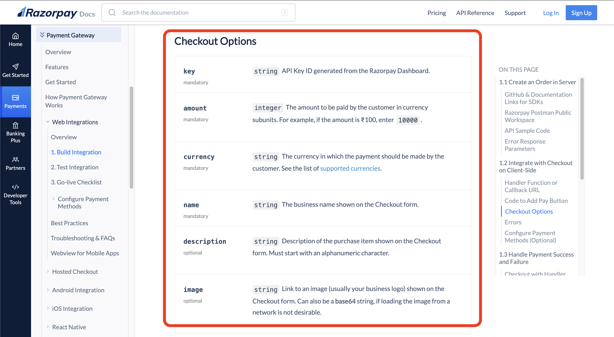
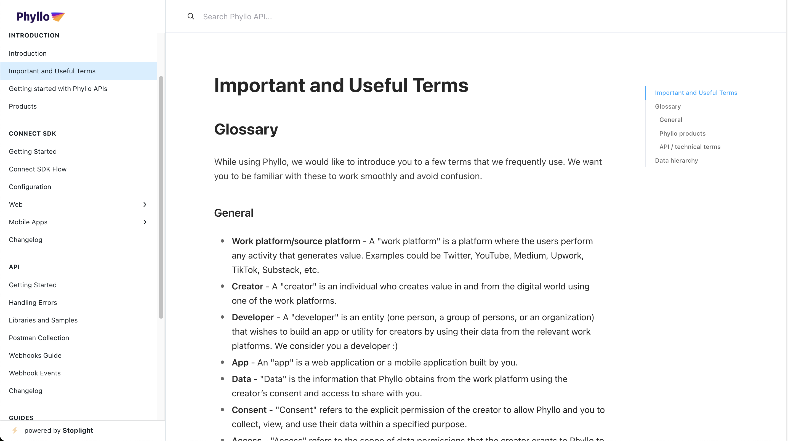

# unREST among the docs

---

<!--
paginate: true
header: unREST among the docs
-->

# What are we going to talk about

- Designing the docs
- For a better developer experience

---

# Who is this discussion for

- Technical writers - because they are faced with such problems and dilemmas almost daily
- Designers - who are working on technical information systems
- Developers - who want to be better at writing systems

---

<!--

-->

# `whoami`

- Akshay Bhalotia
- Professional interests
  - Payment systems
  - Developer SaaS
- Personal interests
  - Cats - proud dad to 2 cats
  - Boardgames
  - Mechanical keyboards

    Find me here <a href="https://axy.one/twitter"></img></a> <a href="https://axy.one/github"></img></a> <a href="https://axy.one/linkedin"></img></a> <a href="mailto:letstalk@axy.one"></img></a>

---

# But why would you listen to me

I've seen some :poop: in my life

- an iOS Developer at an outsourcing boutique and a FinTech API startup
- an account manager at tech events and media company
- support and solutions engineer at another FinTech API startup
- developer relations manager at a real-time video API startup
- and now, a product manager at a data gateway API company

---

# Problem

---

# Docs are hard

- Primary function: **give info**
- But
  - in an easily readable manner
  - in an easily findable manner
  - help with the next steps
  - give enough but not too much
  - expect returning users

---

# What is harder

- Documenting frontend SDKs
- Documenting UI features
- With version control
- Feature-based releases, without a release cycle
- Breaking changes

---

# Let's see a few examples of how I've tried tackling some of these challenges

---

### Razorpay - Payment APIs for India

</img>

An intro page helps the reader navigate to their appropriate section.

---

### Razorpay - Payment APIs for India

</img>

When you click on any of the options, you land on the related overview section, but all the other options are available in the sidebar for easy navigation.

---

### Razorpay - Payment APIs for India

</img>

All the steps are listed within the context, even if they are not related to the front end. Context matters. Complete information helps developers make better decisions.

---

### Razorpay - Payment APIs for India

</img>

Clear differentiation and code samples for available options.

---

### Razorpay - Payment APIs for India

</img>

Proper reference for all parameters.

---

### Razorpay - Payment APIs for India

</img>

Switching to some other platform, say iOS, follows a very similar structure so the reader can expect what to find here.

---

### Razorpay - Payment APIs for India

</img>

Platform-specific instructions and videos/gifs for steps to be performed in the IDE.

---

### Razorpay - Payment APIs for India

</img>

Using callouts to draw attention to specific points.

---

### Dyte - real-time audio and video call APIs

</img>

The landing page shows all the available options.

---

### Dyte - real-time audio and video call APIs

</img>

One of the best things we think we designed is the navigation. See how both the UI SDK and Core SDK are housed under the Web SDK section but at the top level. And within each of them, you can select a different platform or framework. The best part? When you select a component or page and switch the framework, the context is preserved!

---

### Dyte - real-time audio and video call APIs

</img>

Strong belief in "show not tell" - live editor!

---

### Dyte - real-time audio and video call APIs

</img>

Strong belief in "show not tell" - a visual representation

---

### Dyte - real-time audio and video call APIs

</img>

Strong belief in "show not tell" - actual renders

---

### Dyte - real-time audio and video call APIs

</img>

Strong belief in "show not tell" - gifs which show the effect of code change

---

### Dyte - real-time audio and video call APIs

</img>

All relevant info at a single place.

---

### Dyte - real-time audio and video call APIs

</img>

All relevant info at a single place.

---

### Dyte - real-time audio and video call APIs

</img>

But also separately as a reference.

---

### Dyte - real-time audio and video call APIs

</img>

Bonus - Design for developers!

---

### Phyllo - Data gateway for the digital economy

</img>

Clear demarcation for SDK and API sections

---

### Phyllo - Data gateway for the digital economy

</img>

Glossary towards the beginning

---

### Phyllo - Data gateway for the digital economy

</img>

Visual indicators for the flow

---

### Phyllo - Data gateway for the digital economy

</img>

Visual reference for the components

---

### Phyllo - Data gateway for the digital economy

</img>

A clear distinction between web (which is browser-based) and mobile native SDKs

---

### Phyllo - Data gateway for the digital economy

</img>

There is a choice between two options

---

### Phyllo - Data gateway for the digital economy

</img>

Which is clearly explained and differences highlighted

---

### Phyllo - Data gateway for the digital economy

</img>

Along with a callout for the most common mistake/misunderstood path

---

### Phyllo - Data gateway for the digital economy

</img>

And that misunderstood path - mobile in-app browsing - also gets a page of its own to explain things better

---

### Phyllo - Data gateway for the digital economy

</img>

Try to keep the flow and explanation of steps same, or as much similar as possible

---

### Phyllo - Data gateway for the digital economy

</img>

Maintain a changelog (this is probably not the best way but work with whatever you have)

---

# Let's see a few examples of how I've seen others give it a go

---

I tried turning towards two of the most popular frontend frameworks that are used to build modern apps, and here is what I find.

---

### React JS

&nbsp;&nbsp;&nbsp;&nbsp;</img></img>

You would imagine something that is so popularly used to build interfaces and visual components would have more visual diversity in the docs.

---

### Vue JS

</img>&nbsp;&nbsp;&nbsp;&nbsp;</img>

But they are rather boring walls of method references and guides/tutorials.

---

### Lottie

</img>

Something that is used to build animations has absolutely no animations on the docs and just a lot of text.

---

### Auth0

</img>&nbsp;&nbsp;&nbsp;&nbsp;</img>

Provide a lot of starter kits and guides for different frameworks.

---

### Agora

</img>

Make it a breeze to interoperate.

---

And lastly, we have the love of all documentation geeks, that probably everyone looks up to.

---

### Stripe

Stripe provides two frontend integrations - Stripe Checkout (pre-built complete checkout UI) and Stripe Elements (components to build the payments part of your checkout experience). Here is how they document both.

---

### Stripe

</img>&nbsp;&nbsp;&nbsp;&nbsp;</img>

Introduce the feature on a landing page and give the most common options to read further about.

---

### Stripe

</img>

But why it works so well is that they also provide sort of a live code integration walkthrough. This is where you land when you click "get started with Elements".

---

### Stripe

</img>

Very similar experience for the pre-built checkout section too, since most options on that screen (such as payment methods, collect address, etc.) are controlled by the API request you make before starting the payment.

---

### Stripe

</img>

Despite this great step-by-step hand holding, they have complete references for their SDKs in case someone would like to make use of a specific component for a specific use case, or a tinkerer would like to tinker.

---

# Conclusion

I don't know if there are rules or guidelines that I can give you. It's all very contextual and that's not great.

## What we can certainly do

- Think of the user
- Think about what matters to them
- Try not to overwhelm
- But keep information accessible
- Interoperability and drawing parallels between frameworks help

---

# My sincere wish

Standards for method definitions, across languages and frameworks, including UI components

---

## Thank you for listening to my rant

</img>

_I can try answering your questions now, no guarantees though._
